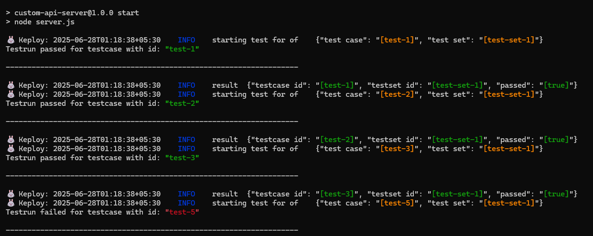
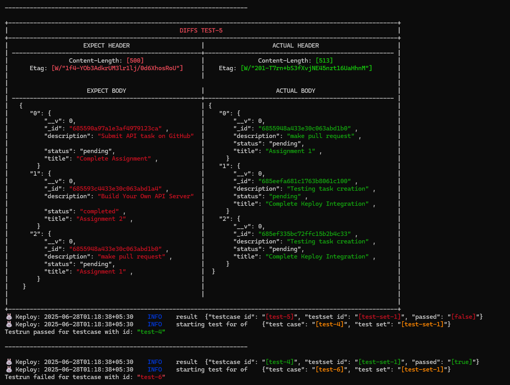
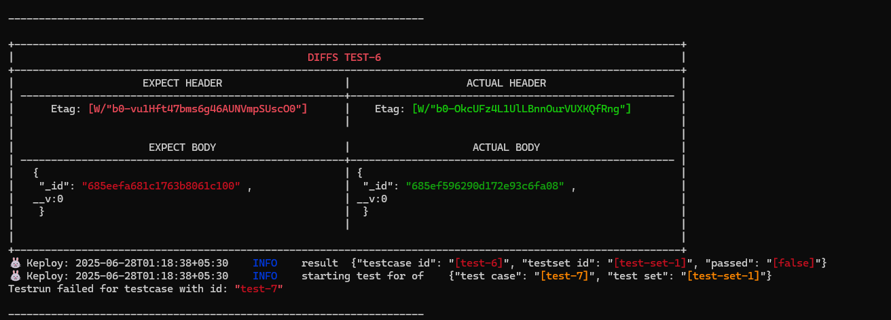
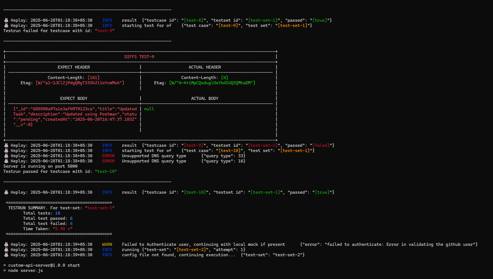
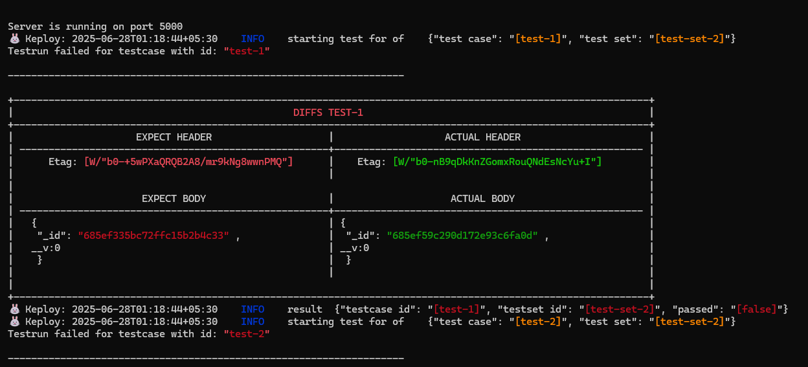
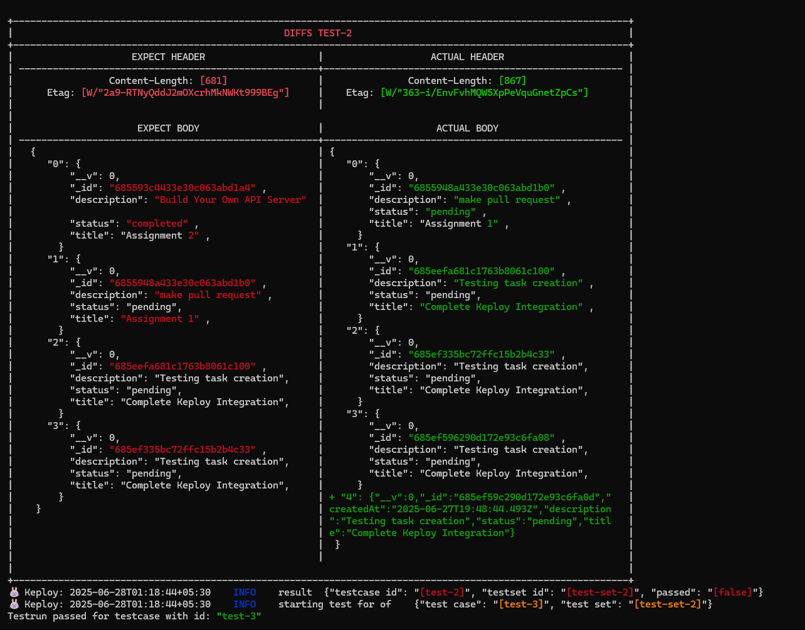
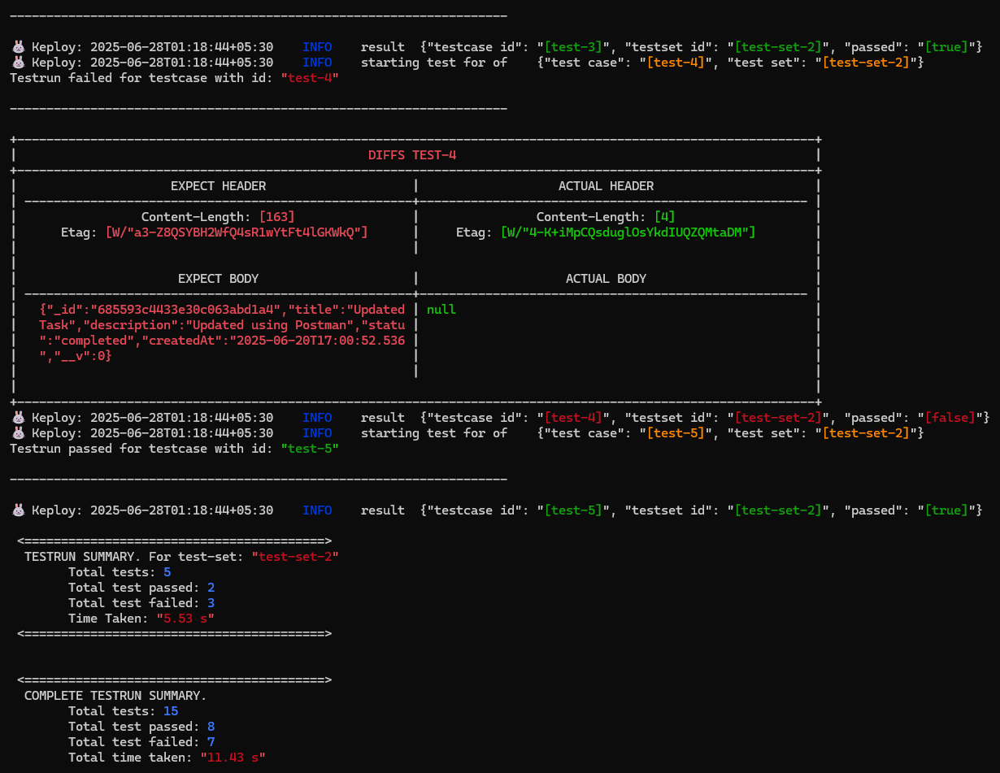
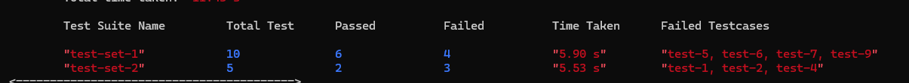
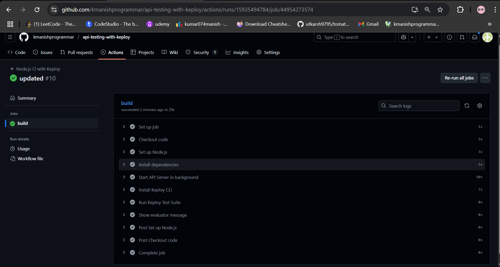

# 🧠 Task Manager API

A RESTful API built using **Node.js**, **Express**, and **MongoDB**, integrated with **Keploy** for automated API testing and **GitHub Actions** for CI/CD.

---

## 📌 Features

- Task creation, update, delete, and view
- MongoDB-backed persistence
- API test recording and replay via Keploy
- CI automation using GitHub Actions
- Docker-ready (optional)

---

## 🛠️ Setup Instructions

### 1. Clone Repository

```bash
git clone https://github.com/kmanishprogrammar/task-manager-api-tests.git
cd task-manager-api-tests
```

### 2. Install Dependencies

```bash
npm install
```

### 3. Setup Environment

Create a `.env` file:

```
PORT=5000
MONGODB_URI=mongodb://localhost:27017/taskdb
```

---

## 🚀 Start the API Server

```bash
npm start
```

You should see the app running at: `http://localhost:5000`


---

## 🧪 Record API Tests with Keploy

### 1. Install Keploy

```bash
curl --silent -L https://keploy.io/ent/install.sh | bash
```

### 2. Record Tests

```bash
keploy record -c "npm start"
```

Now hit some endpoints using Postman or curl to generate test data.

---

## 🔁 Replay API Tests with Keploy

Make sure the server is **not already running**, then run:

```bash
keploy test -c "npm start" --delay 5
```

Keploy will replay all tests saved in the `keploy/` directory.


---

## ⚙️ GitHub Actions CI/CD

GitHub Actions is used to:

- Install dependencies
- Start the API server
- Run `keploy test-suite`
- Verify all tests pass in CI


---

## 📁 Folder Structure

```
task-manager-api-tests/
├── controllers/
├── models/
├── routes/
├── keploy/               # Keploy tests stored here
│   ├── test-set-1/
│   │   ├── test1.yaml
│   │   └── ...
├── .github/
│   └── workflows/
│       └── ci.yml
├── .env
├── server.js
└── README.md
```

---

## 🐳 Docker Support (Optional)

```bash
docker build -t task-api .
docker run -p 5000:5000 task-api
```

---

## ✅ Note to Evaluator

- ✔ All Keploy tests are inside `keploy/`
- ✔ GitHub Actions pipeline successfully executes tests
- ✔ Screenshots included for all major steps
- ✔ Tests work both locally and in CI
- ✔ Repo is clean and production-ready

---

## 👤 Author

**Manish Kumar**  
GitHub: [@kmanishprogrammar](https://github.com/kmanishprogrammar)

---

## 📜 License

This project is licensed under the MIT License.

---

## 📷 Screenshot Index

<div align="center">

<table>
  <tr>
    <td></td>
    <td></td>
  </tr>
  <tr>
    <td></td>
    <td></td>
  </tr>
  <tr>
    <td></td>
    <td></td>
  </tr>
  <tr>
    <td></td>
    <td></td>
  </tr>
  <tr>
    <td></td>
    <td></td>
  </tr>
</table>

</div>
